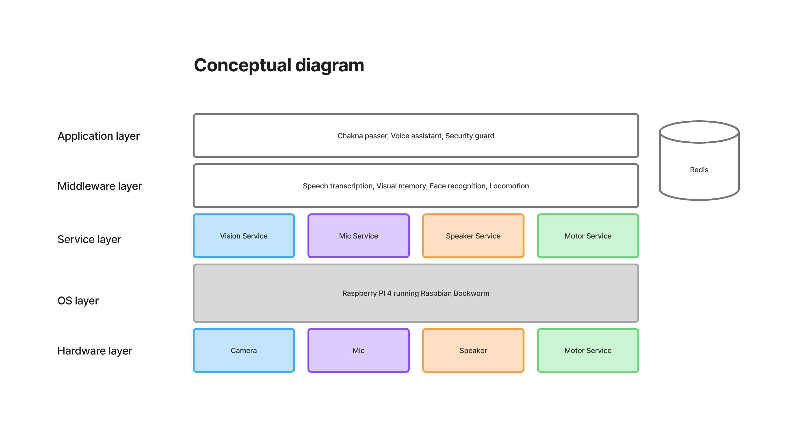

# Chakna

> Building a silly robot that passes chakna around the house to guests.

> It may be useful. It may be not. But it will be fun.



## Hardware
- Raspberry PI 4
- Webcam for camera
- Mic for audio input
- Speakers for audio output

## Setup
Install Raspbian 64 bit lite version on the PI

### Install libraries
```bash
$ sudo apt install -y libgl1-mesa-glx
$ sudo apt install libglib2.0-0 libsm6 libxrender1 libxext6
$ sudo apt-get install portaudio19-dev
$ sudo apt install libatlas-base-dev
```

### Install optional bluetooth libs
```bash
$ sudo apt install bluetooth bluez pulseaudio pulseaudio-module-bluetooth
$ sudo systemctl enable bluetooth
$ sudo systemctl start bluetooth
```
Setup with these [commands](https://chatgpt.com/g/g-p-680af82a7bd8819190c61d2a9aeb0212-chakna/c/680cd12a-4b58-8004-bd95-946672da242e)

### Install CMake
```bash
$ sudo apt install -y cmake build-essential libboost-all-dev
$ sudo apt install -y libopenblas-dev liblapack-dev
$ sudo apt install -y libx11-dev libgtk-3-dev  # For OpenCV support
```

### Redis
[Install](https://redis.io/docs/latest/operate/oss_and_stack/install/install-stack/apt/) the latest version of redis that supports vector storage and similarity search.

### Environment variables.
Create a .env file with
```
OPENAI_API_KEY=
```

Finally run
```bash
$ uv sync
```

## Sensors & Actuators


### VisionClient aka Eyes 👀

You can write applications that want to play with camera feed. The camera is assumed to be regular USB webcam.

Run the service
```bash
$ python3 -m sensors.vision.camera_service_csi # If you want to use the Pi camera (This can't run inside venv)
$ uv run -m sensors.vision.camera_service_usb # If you want to use the USB camera
```

Then the applications will be able to read the last frame the camera has seen. 

```python
from sensors.vision.client import VisionClient

# Initialize client
client = VisionClient()

# Read the latest frame
frame_id, image = client.read()

# Process the image and do something fun
```

### AudioClient aka Ears 👂👂

Run the service
```bash
$ uv run -m sensors.audio.audio_service
```

Then write an application to listen to audio.
```python
from sensors.audio.client import AudioClient

def process_audio(chunk, config):
    # Process audio chunk in real-time
    pass

# Initialize client
client = AudioClient()

# Start streaming with callback
client.start_streaming(callback=process_audio)

# ... application logic ...

# When done
client.stop_streaming()
```

### SpeakerClient aka Mouth 🗣️

You can write applications that want to play audio through the Pi’s speaker.

#### Run the Speaker service

Run the service:

```bash
uv run -m actuators.audio.speaker_service
```
Then write an application to play audio.
```python
from actuators.audio.client import SpeakerClient

# Initialize the client
client = SpeakerClient()

# Open your WAV file and read into audio data
client.play(audio_data)

```

## Middlewares
### Face recognition
```
$ uv run -m middlewares.face_recognition.middleware
```

### Speech transcription
```
$ uv run -m middlewares.speech_transcription
```

## Sample applications
See some sample applications in the [applications](./applications) directory.

## Development related stuff
To keep code synced between your machine and the Pi, place the following in file called `sync.sh`
```bash
rsync -avz --delete --exclude ".venv/" --exclude "__pycache__/" ./  pi@raspberrypi.local:/home/pi/chakna/
```

and then do
```bash
$ chmod +x sync.sh
$ ./sync.sh
```
## Deployment
Move the files under systemd_files to `/etc/systemd`
```bash
$ sudo cp systemd_files/* /etc/systemd/system/
```
and then
```bash
$ sudo systemctl daemon-reload
$ sudo systemctl enable chakna-camera.service chakna-audio-sensor.service chakna-audio-speaker.service chakna-status-monitor.service
$ sudo systemctl start  chakna-camera.service chakna-audio-sensor.service chakna-audio-speaker.service chakna-status-monitor.service
```

Status monitor is available on port 9000 that shows the status of services.

